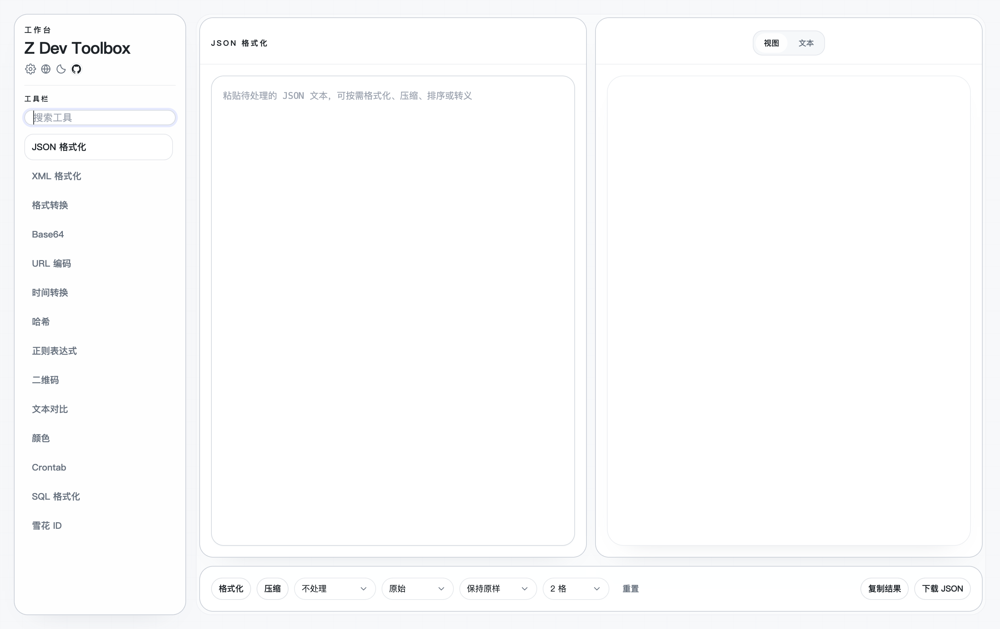
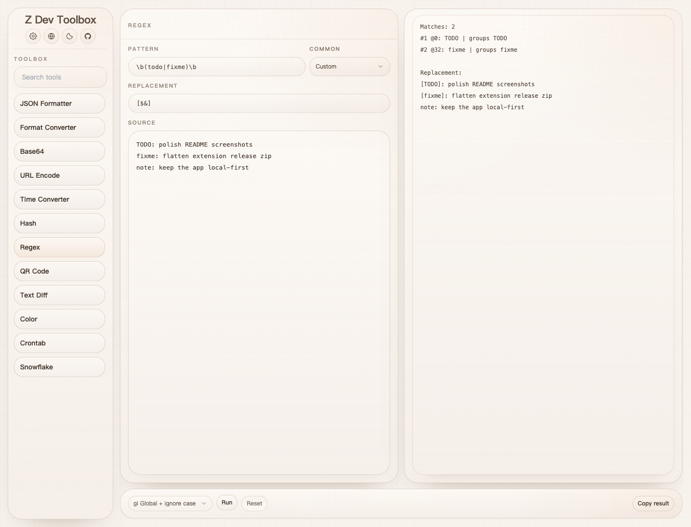
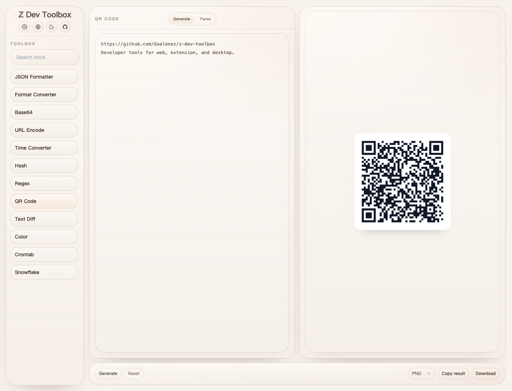
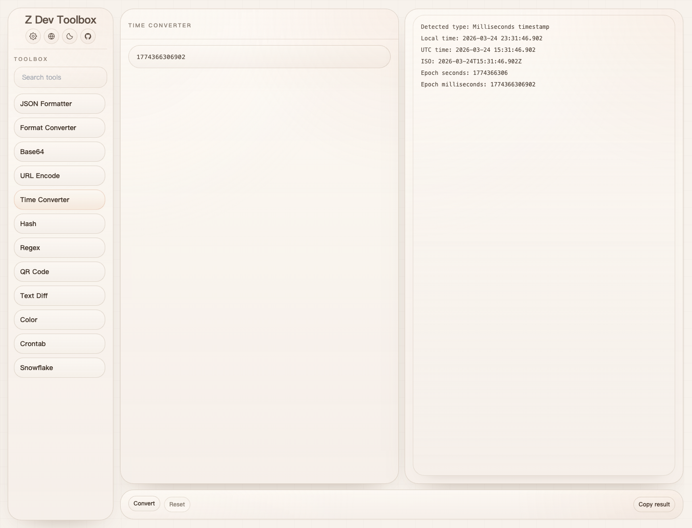

# Z Dev Toolbox

[English](./README.md)

Z Dev Toolbox 是一个面向日常开发场景的本地优先开发者工具箱。
它同时提供 Web、浏览器插件和桌面端，让你在不同工作环境里都能使用同一套高频小工具。

这个仓库不包含后端服务，偏好设置保存在各自平台的本地环境中。

## 界面示例

| JSON 工具 | 正则表达式 |
| --- | --- |
|  |  |
| 先把 JSON 格式化、检查清楚，再继续做转换、调试或复制。 | 测试正则、查看匹配结果，并在真正改文件前先预览替换结果。 |

| 二维码 | 时间转换 |
| --- | --- |
|  |  |
| 不离开工具箱即可生成或解析二维码。 | 快速解析时间戳和日期时间字符串，对照本地时间与 UTC。 |

## 特点

- 本地优先，不依赖账号、云端服务或仓库内后端。
- Web、浏览器插件、桌面端共享同一套核心工具能力。
- 聚焦开发中最常用的高频实用工具，而不是做成复杂的平台。
- 适合“粘贴、处理、复制、继续工作”的轻量工程流。

## 内置工具

- JSON 格式化与校验
- JSON、YAML、TOML、XML、CSV、properties、HTML、HTTP 之间的格式转换
- Base64 编码与解码
- URL 编码与解码
- 时间戳与日期时间转换
- 哈希生成
- 正则测试与替换
- 二维码生成与解析
- 文本差异对比
- 颜色值转换
- Crontab 预览
- 雪花 ID 生成

## 获取方式

### Web

Docker 镜像只包含 Web 端。

#### Docker Compose

```yaml
services:
  z-dev-toolbox:
    image: goalonez/z-dev-toolbox:latest
    container_name: z-dev-toolbox
    ports:
      - 8080:80
    restart: unless-stopped
```

#### Docker Run

```bash
docker run -d \
  --name z-dev-toolbox \
  -p 8080:80 \
  --restart unless-stopped \
  goalonez/z-dev-toolbox:latest
```

启动后打开 `http://localhost:8080`。

如果你想固定镜像版本，把 `latest` 替换成具体 release，例如 `goalonez/z-dev-toolbox:1.0.3`。

### 浏览器插件

浏览器插件已上架 [Chrome 网上应用店](https://chromewebstore.google.com/detail/z-dev-toolbox/pbilldenadmdoiccepjobgopdlefpnoc)，直接从商店安装即可。

### 桌面端

macOS、Windows、Linux 三个平台的桌面端产物同样发布在 [GitHub Releases](https://github.com/Goalonez/z-dev-toolbox/releases)。

当前 macOS 版本的应用尚未完成 Apple 签名 / 公证，首次打开时系统可能提示“应用已损坏”或“无法验证开发者”。
如果你确认安装包来自本项目发布页，可以在终端执行以下命令后再打开：

```bash
sudo xattr -d com.apple.quarantine "/Applications/Z Dev Toolbox.app"
```

## 从源码运行

### 环境要求

- Node.js `24.14.0`
- `pnpm@10`
- 如果你要运行桌面端，还需要 Rust 工具链和 Tauri 前置依赖

仓库以 [`.nvmrc`](./.nvmrc) 作为 Node.js 版本基准，GitHub Actions 也使用同一版本。

安装依赖：

```bash
pnpm install
```

### 开发命令

```bash
pnpm dev:web
pnpm dev:extension
pnpm dev:desktop
```

### 构建命令

```bash
pnpm build:web
pnpm --filter @z-dev-toolbox/extension build
pnpm --filter @z-dev-toolbox/desktop tauri:build
```

### 校验命令

```bash
pnpm lint
pnpm typecheck
pnpm test
```

## 仓库结构

这个仓库使用 `pnpm` workspace 和 Turborepo 管理。

```text
apps/
  web/         Web 应用
  extension/   浏览器插件
  desktop/     Tauri 桌面应用

packages/
  app-shell/      共享应用壳层
  config/         共享 TypeScript 与 Tailwind 配置
  core/           工具逻辑
  platform/       剪贴板、文件导出等平台适配
  shared/         公共类型
  state/          Zustand 状态
  storage/        存储适配
  tool-registry/  工具清单与面板实现
  ui/             共享 UI 组件
```

## 感谢支持

感谢 OpenAI Codex 和 Claude 在实现、迭代与文档整理过程中提供的支持。

## 许可证

本项目使用 Apache License 2.0，详见 [LICENSE](./LICENSE)。
